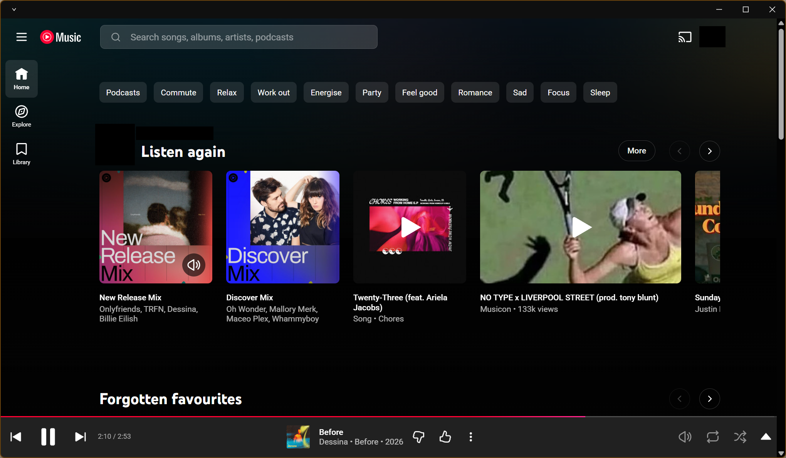
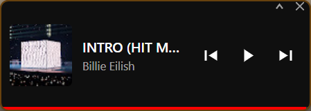

<div align="center">


# YTP

**A sleek desktop player for YouTube Music**

[](https://github.com/AusSherro/youtube-music-player/releases/latest)
[](LICENSE)
[](https://github.com/AusSherro/youtube-music-player/releases)

Play YouTube Music in its own dedicated window — no browser tabs, no clutter.<br>
Compact always-on-top mini player keeps your music visible while you work.

<br>

[**Download**](#-download) · [**Features**](#-features) · [**Screenshots**](#-screenshots) · [**Build from Source**](#-build-from-source)

</div>

<br>

---

<br>

## 📥 Download

> **Windows only** — grab the latest release and start listening.

| File | Description |
|------|-------------|
| [**ytp-x.x.x-setup.exe**](https://github.com/AusSherro/youtube-music-player/releases/latest) | Installer (recommended) |
| [**ytp-x.x.x.exe**](https://github.com/AusSherro/youtube-music-player/releases/latest) | Portable — no install needed |

👉 Head to the [**Releases**](https://github.com/AusSherro/youtube-music-player/releases) page for all versions.

<br>

## ✨ Features

<table>
<tr>
<td width="50%">

### 🎵 Full YouTube Music Experience
The complete YouTube Music web app running in its own window — sign in with your Google account, access your playlists, and enjoy ad-free playback with YouTube Premium.

</td>
<td width="50%">

### 🖼️ Always-on-Top Mini Player
A compact floating player that stays above all your windows. Shows album art, track info, and playback controls. Resize it, drag it anywhere — it remembers its position.

</td>
</tr>
<tr>
<td width="50%">

### ⌨️ Global Media Keys
Control playback from anywhere — play/pause, next track, previous track all work with your keyboard's media keys, even when the app is in the background.

</td>
<td width="50%">

### 🎨 Custom Title Bar
A frameless window with a clean custom title bar that matches YouTube Music's dark aesthetic. Drag to move, window controls where you expect them.

</td>
</tr>
<tr>
<td width="50%">

### 💾 Remembers Your Setup
Window size, position, and mini player placement are saved between sessions. Open YTP and everything is exactly where you left it.

</td>
<td width="50%">

### ⚡ Lightweight & Fast
Minimal wrapper — no bloat, no extra frameworks. Launches fast and uses less memory than running YouTube Music in a browser tab.

</td>
</tr>
</table>

<br>

## 📸 Screenshots

<div align="center">

### Main Window



<br>

### Mini Player



</div>

<br>

## 🛠️ Build from Source

Requires [Node.js](https://nodejs.org/) 18+ and npm.

```bash
# Clone the repo
git clone https://github.com/AusSherro/youtube-music-player.git
cd youtube-music-player

# Install dependencies
npm install

# Run in development mode
npm run dev

# Build Windows installer + portable exe
npm run build:win
```

Build output lands in the `dist/` folder.

<br>

## 🏗️ Tech Stack

| | Technology | Purpose |
|-|------------|---------|
| ⚡ | **Electron 41** | App shell & window management |
| 📘 | **TypeScript** | Type-safe code throughout |
| ⚙️ | **electron-vite** | Fast dev server & builds |
| 📦 | **electron-builder** | Windows packaging (NSIS + portable) |
| 💾 | **electron-store** | Persistent settings |

<br>

## 📄 License

[MIT](LICENSE)

---

<div align="center">
<sub>Built with ❤️ for people who just want YouTube Music in its own window.</sub>
</div>
